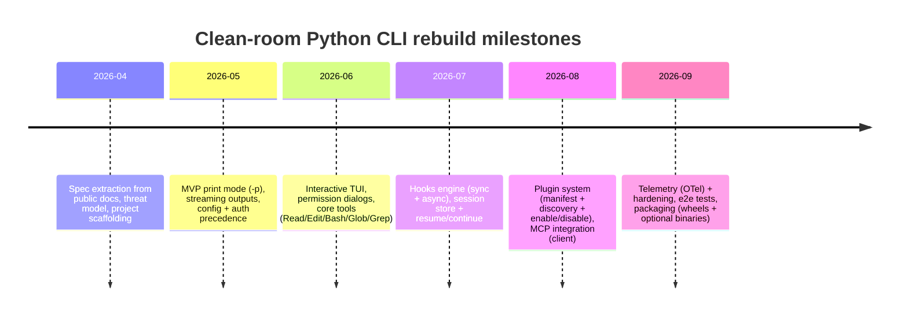

# Rebuilding the Claude Code CLI in Python Without Using Leaked Source

## Executive summary

On March 31, 2026, entity["company","Anthropic","ai company"] accidentally shipped a Claude Code npm release (reported as `@anthropic-ai/claude-code` version 2.1.88) that included a large JavaScript source map (`cli.js.map`). That source map reportedly embedded the original TypeScript sources (via `sourcesContent`), enabling reconstruction of roughly ~1,900 files and ~500,000+ lines of internal CLI code. Anthropic stated the exposure was caused by a release packaging error (human error), not a security breach, and that no sensitive customer data or credentials were exposed. citeturn7view2turn8view2turn8view1

This report does **not** reproduce proprietary code from the leak. Instead, it treats the **official Claude Code documentation as the functional specification** (commands, flags, config formats, plugins, hooks, MCP, auth, telemetry), then provides a **clean-room Python rebuild plan**: architecture, modules, code skeletons, tests, CI, packaging, and security controls. citeturn2view1turn3view0turn4view0turn10view2turn11view3turn12view0turn14view0turn16view0turn15view0

Key “unknowns” that materially affect fidelity—because they are either unpublished or would require using leaked artifacts—include: the exact internal system prompt, proprietary orchestration heuristics, internal feature-flag implementations, and internal service endpoints. The docs explicitly note Claude Code’s internal system prompt is not published, so any reproduction must rely on new prompts/rules you create. citeturn2view4

Deliverables in this report include: a leak artifact inventory (with unknowns called out), inferred CLI architecture (command structure, config, auth, telemetry, plugin/hook system, MCP), tables comparing design options, mermaid diagrams (system architecture, command flow, milestone timeline), and a step-by-step Python implementation plan including reproducible build/test/deploy pipelines with GitHub Actions examples.

## Leak incident and artifact inventory

### What was leaked and how

Public reporting converges on the same core mechanism:

- A Claude Code npm version (widely reported as 2.1.88) briefly included a **~60 MB source map file** (`cli.js.map`) that could be used to recover internal TypeScript sources (when the map includes `sourcesContent`). citeturn7view2turn8view1turn8view2turn8view0  
- The source was quickly mirrored on entity["company","GitHub","code hosting platform"] and elsewhere; takedown requests were reportedly issued. citeturn7view2turn8view2  
- Anthropic publicly characterized the incident as a packaging error and emphasized no credentials/customer data exposure. citeturn7view2turn8view1turn8view2  

### Artifact-level analysis (explicit inventory)

The table below lists **artifact categories** described in reputable reporting and/or implied by standard JS distribution patterns, plus whether they are necessary (or safe) to use in a clean-room rebuild.

| Artifact | File type / format | Reported contents | Rebuild value | Status in this report |
|---|---|---|---|---|
| `cli.js.map` | Source map (JSON) | Embedded TS sources via `sourcesContent`; “~1,900 files / ~500k+ LOC” reconstruction | High (would reveal exact implementation), but using it risks incorporating proprietary code | **Not used**; treated as proprietary |
| Bundled CLI JS | JavaScript bundle | Runtime code that the sourcemap maps back to TS | Medium (implementation details), but proprietary | **Not used** |
| npm package metadata | `package.json`, tarball structure | Versioning, entrypoints, dependency graph | Medium, but may be proprietary in detail; also npm access may be revoked | **Not relied on**; use docs instead |
| “Zip archive on cloud storage” pointer | Archive (unspecified) | Axios reports the debug file pointed to a zip containing the full source | High, but clearly proprietary | **Not used** |
| Binaries / model weights | Executables / checkpoints | No credible reporting that model weights were included; Claude models run server-side | Very high if present, but not indicated | **Unknown / not reported**; treated as **not leaked** |

Citations: reporting on `cli.js.map` size / reconstruction scope / packaging error citeturn7view2turn8view2turn8view1; mention of cloud-archive pointer in Axios citeturn8view2.

### Inferences that are plausible but should be treated carefully

Some reporting suggests implementation-stack clues (e.g., Bun + React + Ink) were visible in leaked materials. One outlet explicitly claims the CLI used **Bun** and a terminal UI built with **React + Ink**. Because this claim is derived from leaked materials (not from official docs), it should be treated as an **unverified implementation detail** rather than a spec requirement. citeturn9view1

Separately, security outlets warned that a leak of this kind can amplify supply-chain and typosquatting risks around dependency confusion and “fake rebuild” efforts. Regardless of whether specific incidents occurred, the general risk is real: **do not install random “mirrors,” “rewrites,” or “repacked CLIs”** in response to a leak. citeturn8view0turn15view0

## Publicly documented CLI surface and configuration model

This section compiles the **official, public** behavior of Claude Code as the authoritative spec for a clean-room rebuild.

image_group{"layout":"carousel","aspect_ratio":"16:9","query":["Claude Code terminal UI screenshot","Claude Code /plugin marketplace screenshot","Claude Code MCP configuration .mcp.json example"],"num_per_query":1}

### Command structure and subcommands

Claude Code’s documented entrypoint is `claude`, supporting interactive and print (“SDK/headless”) modes, session continuation/resume, updater, authentication, agents, MCP, plugins, and remote-control server mode. citeturn2view1turn17view0

A non-exhaustive but high-value command mapping from the official CLI reference:

- **Interactive session**: `claude` and `claude "query"` start interactive sessions; `claude -p "query"` runs a non-interactive print/SDK-style query then exits. citeturn2view1turn17view0  
- **Pipes**: `cat file | claude -p "query"` processes piped content in print mode. citeturn2view1turn17view0  
- **Session continuation**: `claude -c` continues most recent conversation; `claude -r "<session>"` resumes a specified session. citeturn2view1turn17view0  
- **Auth**: `claude auth login|logout|status` is documented (login supports console/API billing mode). citeturn2view1turn14view0  
- **MCP**: `claude mcp ...` configures MCP servers, including add/list/get/remove; the docs also describe using Claude Code as an MCP server via `claude mcp serve`. citeturn2view1turn12view0  
- **Plugins**: `claude plugin ...` manages plugins; docs specify install/uninstall/enable/disable/update plus validation and debugging guidance. citeturn2view1turn10view2  
- **Remote control**: `claude remote-control` starts a server-mode process to control Claude Code from other client surfaces, described as local execution with remote UI connectivity. citeturn2view1turn15view0  

### Flags, modes, and runtime behavior

Claude Code exposes a wide set of flags; several are architecturally important because they define how config, tools, permissions, and observability work:

- **Working directories / access boundaries**: `--add-dir` adds working directories for read/edit access (with caveats on `.claude/` discovery). citeturn2view1  
- **Agents**: `--agent` and `--agents` select/define agents; `claude agents` lists configured subagents. citeturn2view1turn2view3  
- **Bare mode**: `--bare` explicitly skips auto-discovery of hooks/skills/plugins/MCP/auto memory/CLAUDE.md for faster, deterministic scripted calls, and is recommended for `-p` usage. citeturn2view1turn17view0  
- **Permissions**: `--allowedTools`, `--disallowedTools`, `--permission-mode`, and `--dangerously-skip-permissions` formalize the permission architecture and its bypasses. citeturn2view1turn15view0  
- **Output formats**: `--output-format text|json|stream-json`, plus `--include-partial-messages` for fine-grained streaming in print mode. citeturn2view1turn17view0  

### Built-in “slash commands” and interactive UX

In interactive mode, Claude Code provides built-in commands discoverable via `/` (and a command palette-like experience). The built-in commands list includes critical operational flows such as `/config`, `/permissions`, `/hooks`, `/mcp`, `/plugin`, `/rewind` (checkpointing), `/copy`, `/diff`, `/status`, and `/feedback`/`/bug`. citeturn3view0turn4view2

Interactive mode also documents keyboard shortcuts (e.g., `Ctrl+O` verbose toggle, `Ctrl+R` history search, backgrounding tasks, task list UI), which implies a full-screen / TUI-style renderer rather than a simple stdin/stdout loop. citeturn4view1turn4view2

### Tools and permission surface

The Tools Reference documents a set of built-in tools such as `Read`, `Edit`, `Bash`, `Glob`, `Grep`, `LSP`, and more. It also documents which tools require explicit permission (notably `Bash`, `Edit`, notebook edits, etc.). citeturn4view0turn15view0

This is critical for rebuilding: your Python CLI clone needs (a) a similar tool registry, (b) a permission gate, and (c) a standardized way for the LLM to invoke tools and receive results—either via a tool-calling LLM API, or via an agent SDK.

### Configuration files, scopes, and merge rules

Official docs describe hierarchical settings via JSON:

- User: `~/.claude/settings.json`  
- Project: `.claude/settings.json` (committable)  
- Local: `.claude/settings.local.json` (gitignored)  
- Managed-policy settings delivered via multiple mechanisms (server-managed, MDM policies, file-based under system directories). citeturn2view3turn2view4  

They also state that other configuration is stored in `~/.claude.json`, holding preferences, OAuth session, MCP configs, per-project state, and caches; and that Claude Code creates backups of config files. citeturn2view3turn6search6  

The docs further note: Claude Code’s internal system prompt is **not published**, and customization should be done via `CLAUDE.md` or system prompt flags. This explicitly limits “perfect fidelity” rebuilds. citeturn2view4turn2view1  

### Plugins, hooks, and MCP integration (extension model)

Claude Code’s extension architecture is unusually explicit in docs:

- **Plugins** are directories with optional manifest `.claude-plugin/plugin.json`; components include skills, agents, hooks, MCP servers (`.mcp.json`), and LSP server configs (`.lsp.json`). The docs specify directory structure and plugin management CLI commands. citeturn10view2turn10view1  
- **Hooks** are event-driven handlers configured in settings JSON (and plugins), supporting command hooks, HTTP hooks, and prompt/agent hook types, including async background hooks via `"async": true` for command hooks. Hook scripts receive structured JSON on stdin and can influence decisions for certain events (e.g., PreToolUse permission decisions). citeturn11view3turn11view2turn11view4  
- **MCP**: Claude Code connects to tools via the Model Context Protocol, supporting transports (HTTP recommended, SSE deprecated, stdio for local), server management commands (`claude mcp add/list/get/remove`), capability refresh via `list_changed`, OAuth flows for remote MCP servers, plus `.mcp.json` scoping and environment variable expansion. citeturn12view0turn13view3  

On the MCP “standards” side, MCP’s spec documents a JSON-RPC-based protocol with standard transports including stdio and Streamable HTTP, and there is an official Python SDK implementing the protocol. citeturn6search0turn6search1turn6search19

### Authentication and telemetry model

Authentication is multi-mode:

- Browser-based login for subscription/Teams/Enterprise usage. citeturn14view0turn13view1  
- API key (`ANTHROPIC_API_KEY`) and bearer token (`ANTHROPIC_AUTH_TOKEN`) environment variables. citeturn3view1turn14view0  
- `apiKeyHelper` setting to run a script to return an API key, with refresh behavior and TTL controls. citeturn14view0turn3view1  
- Credential storage: macOS keychain; else `~/.claude/.credentials.json` (or `$CLAUDE_CONFIG_DIR`), with file permission guidance. citeturn14view0  
- Explicit precedence ordering among credentials is documented. citeturn14view0turn3view1  

Telemetry is via **opt-in OpenTelemetry**: enabling `CLAUDE_CODE_ENABLE_TELEMETRY=1` and choosing OTel exporters; prompt text and tool arguments are **not** logged by default and are gated by flags such as `OTEL_LOG_USER_PROMPTS` and `OTEL_LOG_TOOL_DETAILS`. citeturn16view0  

## Clean-room Python architecture

This section translates the documented behavior into a Python architecture that can approximate Claude Code’s CLI without using leaked implementation details.

### High-level design goals derived from the docs

A faithful rebuild should support:

- Interactive TUI sessions and print/SDK mode (`-p`) with structured output and streaming. citeturn17view0turn4view1  
- Hierarchical config and scoped extensions: settings JSON, `.mcp.json`, plugin manifests, hook configs, per-user/per-project storage. citeturn2view3turn12view0turn10view2turn11view3  
- Tool registry + permission gates + safety boundaries (read-only default; write restricted to project scope; sandbox option). citeturn15view0turn4view0  
- MCP integration (client + optional server mode) via JSON-RPC over stdio/HTTP. citeturn12view0turn6search0turn6search1  
- Auth precedence and secure credential storage. citeturn14view0turn3view1  
- Optional OpenTelemetry export with strong redaction defaults. citeturn16view0  

### Proposed Python component map

A clean-room rebuild can be organized as:

- `app/cli.py`: Typer or Click command tree; maps to `claude`, `claude auth`, `claude mcp`, `claude plugin`, etc. (mirrors CLI reference). citeturn2view1  
- `app/tui/`: interactive renderer (prompt input, panes for status/history/tasks/permission dialogs).  
- `core/session_store.py`: session IDs, transcript JSONL, resume/continue, retention policies. (Checkpointing is documented behavior; implement independently.) citeturn4view2turn2view1  
- `core/config/`: load/merge settings, scopes, env-var expansion; store “other config” file(s). citeturn2view3turn6search6  
- `core/auth/`: OAuth tokens, API key ingestion, `apiKeyHelper` runner, secure persistence (keyring on macOS; locked-down file otherwise). citeturn14view0turn3view1  
- `agent/loop.py`: orchestrator that sends messages to the model endpoint, dispatches tool calls, enforces budgets/retries, emits hook events.  
- `tools/`: built-in tools (Read/Edit/Bash/Glob/Grep/LSP…), plus wrappers for MCP tool calls. citeturn4view0turn12view0  
- `security/permissions.py`: permission rules (`allow/deny/ask`) compatible with documented rule syntax expectations; enforcement of write boundaries; optional sandbox integration. citeturn15view0turn2view1  
- `ext/hooks.py`: event bus (`SessionStart`, `PreToolUse`, `PostToolUse`, …), command hooks (sync + async), HTTP hooks, and “prompt hooks” that call the LLM with a small prompt+schema to decide. citeturn11view2turn11view3turn11view4  
- `ext/plugins/`: plugin manifest loader and component discovery per `.claude-plugin/plugin.json`, plus plugin cache/persistent-data directories. citeturn10view2turn3view1  
- `ext/mcp/`: MCP client manager using the official Python SDK; supports stdio + Streamable HTTP; tool name mapping `mcp__<server>__<tool>`; handles `list_changed`. citeturn12view0turn6search0turn6search1  
- `observability/otel.py`: OpenTelemetry wiring with safe defaults and explicit opt-in for sensitive fields (mirroring the official telemetry posture). citeturn16view0  

### Mermaid diagram: system architecture

```mermaid
flowchart TB
  subgraph UI[CLI & TUI Layer]
    CLI[typer/click command tree]
    TUI[prompt_toolkit + rich renderer]
  end

  subgraph CORE[Core Services]
    CFG[Config loader + merger<br/>~/.claude/settings.json, .claude/settings.json]
    SESS[Session store<br/>transcripts + resume/continue]
    AUTH[Auth manager<br/>OAuth + API keys + apiKeyHelper]
    OTEL[Telemetry (OTel)<br/>opt-in + redaction]
  end

  subgraph AGENT[Agent Runtime]
    LOOP[Agent loop<br/>turn manager + streaming]
    PERM[Permission engine<br/>modes + rule matching]
    HOOKS[Hook engine<br/>events + async hooks]
    TOOLS[Tool registry<br/>Read/Edit/Bash/Glob/Grep/LSP...]
    MCP[MCP manager<br/>stdio + HTTP transports]
  end

  CLI --> CFG
  CLI --> AUTH
  CLI --> SESS
  CLI --> LOOP
  TUI --> LOOP

  CFG --> LOOP
  AUTH --> LOOP
  OTEL --> LOOP

  LOOP --> PERM
  LOOP --> HOOKS
  LOOP --> TOOLS
  LOOP --> MCP
  MCP --> TOOLS
```

### Trade-off tables for key design choices

#### Sync vs async execution model

| Choice | Pros | Cons | When to choose |
|---|---|---|---|
| Mostly synchronous | Simpler mental model; fewer concurrency bugs | Harder to support streaming + parallel tools + MCP IO without blocking | MVP prototypes; limited tool set |
| Async-first (AnyIO/asyncio) | Natural fit for streaming responses, background hooks, parallel read-only tools, MCP IO | Higher complexity; test harness needs async support | Closest match to documented features (stream-json, background hooks, MCP) citeturn17view0turn11view4turn12view0 |

#### HTTP client library (for model API calls and remote MCP)

| Library | Pros | Cons | Fit |
|---|---|---|---|
| `requests` | Simple; ubiquitous | Awkward streaming + async; no native HTTP/2 async | Not ideal for a streaming agent |
| `httpx` | Sync+async APIs; good streaming support; timeouts/retries | Slightly heavier; learning curve | Recommended for this rebuild |
| `aiohttp` | Mature async | More boilerplate for sync modes; ecosystem complexity | Good if you are purely async |

#### CLI framework selection

| Framework | Pros | Cons | Recommendation |
|---|---|---|---|
| `argparse` | Stdlib; no deps | Verbose; weaker UX | Use for tiny clones only |
| `click` | Stable; widely used | Decorator stack can get heavy | Solid option |
| `typer` | Built on click; type hints → flags; fast to develop | Adds dependency; still click under hood | Best for developer velocity and correctness |

#### Packaging formats

| Format | Pros | Cons | Best for |
|---|---|---|---|
| PyPI wheel + `pipx` | Standard Python distribution; easy updates | Requires Python runtime installed | Developers, CI runners |
| Standalone binary (PyInstaller/Nuitka) | “No Python required” UX; resembles native installers | More complex builds; platform-specific artifacts | Enterprise desktops |
| Container image | Reproducible; isolated dependencies | TUI experience can be awkward; auth persistence harder | CI/CD automation, ephemeral runs |

### “Hardware/cost trade-offs” that are relevant for a CLI rebuild

A Python CLI clone is **not GPU-bound**; it is IO-bound and API-cost-bound.

- Local resources: negligible CPU; memory dominated by transcript/context caching and local file scanning; disk for session history. (These are architectural choices you control.)  
- Real cost drivers: model/API usage and tool execution time; telemetry backends if enabled. Claude Code’s own docs emphasize tracking token usage and costs via metrics, implying real-world operational cost sensitivity. citeturn16view0turn17view0  

## Implementation blueprint and reproducible pipelines

This section gives a step-by-step plan to implement a clean-room Python CLI with the same *documented* behaviors.

### Step-by-step build plan

**Milestone: MVP print mode (`-p`)**
1. Implement `claude_py -p "prompt"` that:
   - Loads config (bare mode supported).
   - Resolves credentials by precedence (env vars → helper → OAuth store).
   - Sends prompt to model endpoint with streaming support.
   - Emits `text` or `json` or `stream-json` output. citeturn17view0turn14view0turn2view1  
2. Add `--max-turns`, `--max-budget-usd` (budget enforcement locally), and a retry layer that can emit machine-readable retry events (mirroring the CLI’s `system/api_retry` concept). citeturn17view0turn2view1  

**Milestone: interactive TUI**
3. Add interactive loop with:
   - Prompt history + reverse search (`Ctrl+R`-like behavior).
   - Permission dialogs.
   - Status area (model, cwd, mode, etc.). citeturn4view1turn15view0  

**Milestone: tool system**
4. Implement the documented core tools in Python:
   - `Read`, `Edit`, `Bash`, `Glob`, `Grep` first; then LSP integration and “agent/subagent” abstractions later. citeturn4view0turn15view0  
5. Permission engine:
   - Modes (`default`, `acceptEdits`, `plan`, etc.) and allow/deny pattern matching.
   - Enforce write boundary: only write to project root/subfolders by default. citeturn15view0turn2view1  

**Milestone: hooks**
6. Build hook engine that:
   - Loads hooks from settings + plugins.
   - Supports command hooks (stdin JSON → stdout JSON).
   - Supports `"async": true` for background hooks.
   - Emits hook events at the documented points (`SessionStart`, `PreToolUse`, `PermissionRequest`, `PostToolUse`, `Stop`, etc.). citeturn11view2turn11view3turn11view4  

**Milestone: plugins**
7. Implement plugin discovery and manifest validation:
   - Recognize `.claude-plugin/plugin.json`.
   - Discover commands/skills/agents/hooks/MCP/LSP config paths per docs.
   - Implement `plugin install|uninstall|enable|disable|update|validate` in your CLI. citeturn10view2  

**Milestone: MCP**
8. Integrate MCP using the official Python SDK:
   - Support stdio and HTTP transports (SSE optional; docs deprecate SSE).
   - Maintain `.mcp.json` with scope handling.
   - Map MCP tools to names `mcp__<server>__<tool>`.
   - Handle `list_changed` refresh.
   - Add `mcp serve` mode to expose your local tool registry as an MCP server (optional but documented for Claude Code). citeturn12view0turn6search1turn6search0  

**Milestone: telemetry**
9. Add OpenTelemetry instrumentation:
   - Opt-in via env var similar to `CLAUDE_CODE_ENABLE_TELEMETRY`.
   - Default to redacting prompt body and tool arguments.
   - Provide switches comparable to `OTEL_LOG_USER_PROMPTS` and `OTEL_LOG_TOOL_DETAILS`. citeturn16view0  

### Recommended project layout (Python)

```text
claude_py/
  pyproject.toml
  README.md
  src/claude_py/
    __init__.py
    __main__.py              # python -m claude_py
    cli.py                   # typer app, subcommands
    tui/
      app.py                 # prompt_toolkit app + render loop
      dialogs.py             # permission dialogs, pickers
      render.py              # rich render helpers
    core/
      config/
        loader.py            # settings scopes + merge
        models.py            # pydantic schemas
        paths.py             # ~/.claude, .claude, managed dirs
      sessions/
        store.py             # transcripts, resume/continue
        checkpointing.py     # optional rewind snapshots
      auth/
        manager.py           # precedence + token storage
        keyring_store.py     # macOS keychain via keyring
        file_store.py        # ~/.claude/.credentials.json
        api_key_helper.py    # run helper script safely
      observability/
        otel.py              # OpenTelemetry wiring
    agent/
      loop.py                # turn manager
      messages.py            # internal message structs
      budgets.py             # token/cost budgets
    tools/
      registry.py
      builtin/
        read.py
        edit.py
        bash.py
        glob.py
        grep.py
      mcp_bridge.py          # wrap MCP tools as tool entries
    ext/
      hooks/
        engine.py
        types.py
      plugins/
        manager.py
        manifest.py
        cache.py
      mcp/
        manager.py
        config.py
  tests/
    test_config_merge.py
    test_permissions.py
    test_hooks.py
    test_mcp_config.py
    e2e/
      test_print_mode.py
      test_interactive_basic.py
  .github/workflows/
    ci.yml
    release.yml
```

This layout cleanly separates: CLI plumbing, TUI, config/auth/session core, agent loop, tools, and extension systems.

### Code skeletons (illustrative, not from leaked code)

#### Typer CLI entrypoint with subcommands

```python
# src/claude_py/cli.py
import typer
from claude_py.core.config.loader import load_effective_config
from claude_py.core.auth.manager import resolve_credentials
from claude_py.agent.loop import run_print_mode, run_interactive

app = typer.Typer(add_completion=True, no_args_is_help=True)
auth_app = typer.Typer()
mcp_app = typer.Typer()
plugin_app = typer.Typer()
app.add_typer(auth_app, name="auth")
app.add_typer(mcp_app, name="mcp")
app.add_typer(plugin_app, name="plugin")

@app.command()
def main(
    prompt: str | None = typer.Argument(None),
    print_mode: bool = typer.Option(False, "--print", "-p"),
    bare: bool = typer.Option(False, "--bare"),
    output_format: str = typer.Option("text", "--output-format"),
):
    cfg = load_effective_config(bare=bare)
    creds = resolve_credentials(cfg)

    if print_mode:
        run_print_mode(cfg=cfg, creds=creds, prompt=prompt or "", output_format=output_format)
    else:
        run_interactive(cfg=cfg, creds=creds, initial_prompt=prompt)

@auth_app.command("status")
def auth_status(text: bool = typer.Option(False, "--text")):
    # Return JSON by default; text if requested
    ...

if __name__ == "__main__":
    app()
```

This mirrors the documented “single binary with subcommands” structure while remaining implementation-independent. citeturn2view1turn14view0  

#### Hook execution model (command hooks)

```python
# src/claude_py/ext/hooks/engine.py
import asyncio, json, subprocess
from dataclasses import dataclass
from typing import Any, Mapping

@dataclass(frozen=True)
class HookHandler:
    type: str                 # "command" | "http" | "prompt" | "agent"
    command: str | None = None
    timeout_s: float = 600.0
    async_run: bool = False   # mirrors `"async": true` for command hooks

async def run_command_hook(handler: HookHandler, event_payload: Mapping[str, Any]) -> dict[str, Any]:
    proc = await asyncio.create_subprocess_shell(
        handler.command,
        stdin=asyncio.subprocess.PIPE,
        stdout=asyncio.subprocess.PIPE,
        stderr=asyncio.subprocess.PIPE,
    )
    stdin = json.dumps(event_payload).encode("utf-8")
    try:
        out, err = await asyncio.wait_for(proc.communicate(stdin), timeout=handler.timeout_s)
    except asyncio.TimeoutError:
        proc.kill()
        return {"systemMessage": f"Hook timed out after {handler.timeout_s}s"}

    if proc.returncode not in (0, 2):  # reserve code 2 semantics if you implement it
        return {"systemMessage": f"Hook failed rc={proc.returncode}: {err.decode('utf-8', 'ignore')}"}

    out_s = out.decode("utf-8", "ignore").strip()
    if not out_s:
        return {}
    # Hook output can be JSON; fallback to plain text as context.
    try:
        return json.loads(out_s)
    except json.JSONDecodeError:
        return {"additionalContext": out_s}
```

This matches the doc-level contract: command hooks receive JSON on stdin and can emit structured JSON output. citeturn11view2turn11view3  

### Reproducible CI pipelines (GitHub Actions examples)

The official Claude Agent SDK repo demonstrates multi-platform packaging and wheel-building patterns (including bundling a CLI), which is useful as inspiration for robust Python packaging workflows. citeturn18view0

#### CI workflow: tests + lint + typecheck

```yaml
# .github/workflows/ci.yml
name: CI
on:
  push:
  pull_request:

jobs:
  test:
    runs-on: ubuntu-latest
    strategy:
      matrix:
        python-version: ["3.10", "3.11", "3.12"]

    steps:
      - uses: actions/checkout@v4

      - uses: actions/setup-python@v5
        with:
          python-version: ${{ matrix.python-version }}

      - name: Install
        run: |
          python -m pip install --upgrade pip
          pip install -e ".[dev]"

      - name: Lint
        run: |
          ruff check .
          ruff format --check .

      - name: Typecheck
        run: |
          mypy src/claude_py

      - name: Unit tests
        run: |
          pytest -q
```

#### Release workflow: build wheels + publish to PyPI

```yaml
# .github/workflows/release.yml
name: Release
on:
  workflow_dispatch:
  push:
    tags:
      - "v*"

jobs:
  build:
    name: Build wheels
    runs-on: ubuntu-latest
    steps:
      - uses: actions/checkout@v4
      - uses: actions/setup-python@v5
        with:
          python-version: "3.12"

      - name: Build sdist/wheel
        run: |
          python -m pip install --upgrade pip build twine
          python -m build
          twine check dist/*

      - name: Upload artifacts
        uses: actions/upload-artifact@v4
        with:
          name: dist
          path: dist/*

  publish:
    needs: build
    runs-on: ubuntu-latest
    permissions:
      id-token: write  # OIDC for PyPI trusted publishing
    steps:
      - uses: actions/download-artifact@v4
        with:
          name: dist
          path: dist

      - name: Publish to PyPI
        uses: pypa/gh-action-pypi-publish@release/v1
```

### Mermaid diagram: CLI command flow

```mermaid
flowchart LR
  U[User] -->|prompt| TUI[TUI/CLI parser]
  TUI --> CFG[Load config + env]
  CFG --> AUTH[Resolve credentials]
  AUTH --> HOOKS[SessionStart hooks]
  HOOKS --> LOOP[Agent turn loop]

  LOOP -->|model call (streaming)| LLM[Model API]
  LLM -->|tool call| PERM[Permission engine]
  PERM -->|PreToolUse hooks| HOOKSPRE[Hooks]
  HOOKSPRE --> TOOLS[Execute tool]
  TOOLS --> HOOKSPOST[PostToolUse hooks]
  HOOKSPOST --> LOOP

  LOOP --> OUT[Render output]
  OUT --> U
```

### Mermaid diagram: implementation timeline (milestones)



## Security, privacy, legal, and ethical risk assessment

### Legal and ethical risks of using leaked artifacts

Even when code is publicly mirrored, using proprietary leaked source to rebuild a commercial tool can create serious exposure (copyright/trade secret/ToS violations). Reporting indicates takedown activity occurred after mirroring, consistent with IP enforcement expectations. citeturn7view2turn8view2

**Mitigation (clean-room standard):**
- Use **only** official docs + open standards (MCP spec/SDK) + your own original code. citeturn12view0turn6search19turn6search1  
- Maintain a written “spec dossier” derived from citations and public docs, then implement from that spec.  
- Avoid importing any leaked repos, patches, or “Python rewrites” that may have copied code (even indirectly). One outlet explicitly removed a link to a Python rewrite out of caution. citeturn9view1  

### Security risks for a rebuilt agentic CLI

Claude Code’s own security guidance highlights why agentic CLIs are high-risk: they can read/edit files and execute commands, so permission architecture and boundaries are foundational. citeturn15view0turn4view0

**Required controls to replicate (and improve):**
- **Read-only by default**; explicit approval for edits and shell commands (and a clear record of those approvals). citeturn15view0turn4view0  
- **Write boundary enforcement**: restrict writes to the project root/subfolders unless explicitly expanded (docs describe a similar boundary). citeturn15view0  
- **Prompt injection defenses**:
  - Treat untrusted repo content and MCP outputs as hostile.
  - Require trust confirmation for new workspaces / new MCP servers (the official docs describe trust verification as part of safeguards). citeturn15view0turn12view0  
- **Hooks and plugins are code execution**:
  - Hooks run with the user’s permissions; official docs warn to validate/sanitize inputs and quote variables. Your clone should adopt the same posture and add sandboxing where possible. citeturn11view4turn11view3  
  - Enforce path traversal protections and plugin root confinement (the plugin docs discuss path behavior rules and limitations). citeturn10view0turn10view1  

### Privacy and telemetry risks

Claude Code’s official monitoring guidance stresses:
- Telemetry is opt-in.
- Prompt text and tool inputs are redacted by default; enabling them increases sensitivity and requires backend redaction. citeturn16view0  

**Mitigation for a Python rebuild:**
- Default telemetry to **off**; require explicit user consent.
- Implement discrete “sensitivity toggles” exactly because it’s too easy to accidentally ship confidential content in logs.
- Store transcripts locally with user-configurable retention; encrypt at rest if possible; avoid uploading transcripts unless user explicitly exports/shares.

### Operational and supply-chain risks after a leak

After a public leak, attackers often publish lookalike installers, typosquatted packages, or “rebuild scripts.” Security reporting explicitly raised the risk of dependency confusion/typosquatting tied to “people trying to compile leaked source.” citeturn8view0turn7view2

**Mitigation:**
- Pin dependencies with hash checking (e.g., `pip-tools` with hashes).
- Use `pip-audit`/`osv-scanner` in CI.
- Sign releases (Sigstore / provenance) and publish SBOMs.
- Provide a deterministic, reproducible build process (CI artifacts only; no “curl | bash” in your own distribution unless you can sign and verify aggressively).

### Assumptions and explicit unknowns

Assumptions made to produce a practical rebuild plan:
- The rebuild targets **documented behaviors** (CLI reference, hooks, plugins, MCP, auth, telemetry), not undocumented roadmap features referenced in leak reporting. citeturn2view1turn10view2turn12view0turn14view0turn16view0  
- The underlying LLM inference is done via an external model/API, not local weights; no credible reporting indicates model weights were leaked with the CLI artifact. citeturn7view2turn8view2  

Unknown / intentionally not reproduced:
- Any leaked internal prompts, heuristics, hidden feature implementation details, or proprietary orchestration layers.
- Exact internal UI rendering stack (claims like Bun/React+Ink are treated as unverified). citeturn9view1  
- Exact internal binary packaging and update mechanism beyond what is publicly documented (e.g., native installers and their auto-update claims are doc-level behaviors, not implementation). citeturn13view1turn20search0